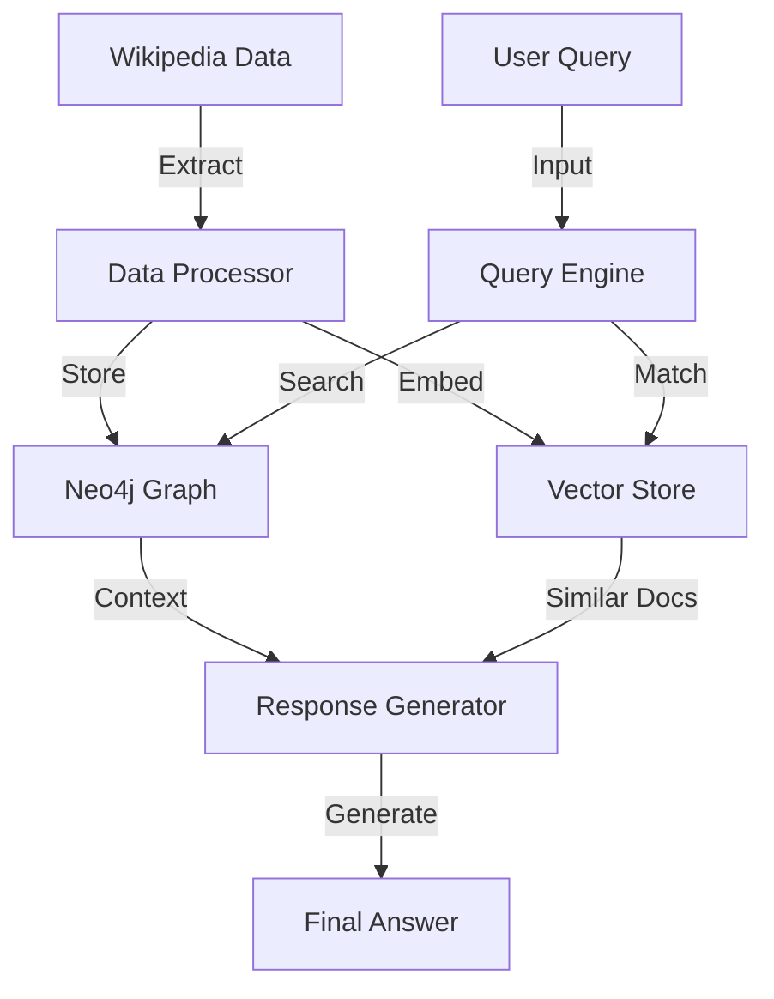

# Wikipedia Knowledge Graph RAG System

[](https://www.python.org/)
[](https://neo4j.com/)
[](https://openai.com/)
[](https://www.wikipedia.org/)

An intelligent question-answering system powered by knowledge graphs, combining Neo4j database and Wikipedia data for efficient Retrieval-Augmented Generation (RAG).

## Core Features

- 🔍 Smart Retrieval - Hybrid vector and graph-based search
- 📚 Knowledge Construction - Automated Wikipedia entity relationship extraction
- 🧠 Context Aware - Multi-turn conversation memory
- 🔄 Real-time Updates - Dynamic Wikipedia data synchronization

## Prerequisites

- Python 3.8+
- Neo4j Database
- OpenAI API access

## Environment Variables

Create a `.env` file with:

```env
AURA_INSTANCENAME=your_instance
NEO4J_URI=your_uri
NEO4J_USERNAME=your_username
NEO4J_PASSWORD=your_password
NEO4J_DATABASE=your_database
OPENAI_API_KEY=your_key
OPENAI_ENDPOINT=your_endpoint
```

## Installation

```bash
pip install -r requirements.txt
```

## Usage

```python
python wikipedia_kg_rag.py

```

Example queries:

```python
# Simple query
"How did the Roman empire fall?"

# Query with chat history
"When did he become the first emperor?"
```

## Architecture


